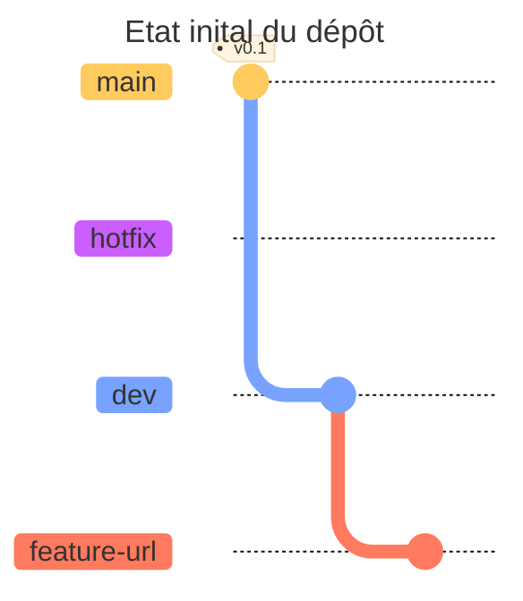
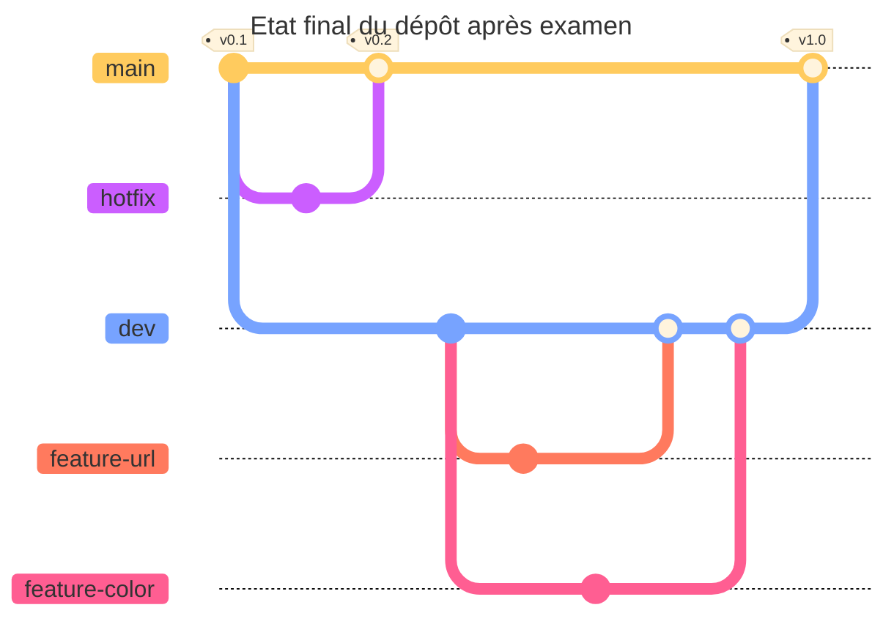

## Consignes

Vous travaillez en groupe sur un dépôt GitHub pour produire un site web en Golang.

Le site affiche pour le moment une page vide. Deux fonctionnalités seront développées en parallèle, depuis la branche `dev` déjà existante (voir schéma de l’état initial du dépôt).

La première est l’affichage de l’URL visitée par l’utilisateur, dans la branche `feature-url`, où la branche est déjà créée et le développement est terminé. La seconde fonctionnalité est l’affichage d’une page en couleur, dans la branche `feature-color` qui devra être créée et développée par vous.

Chaque exercice peut être fait indépendamment.

### Etat inital du dépôt


### Etat final du dépôt après examen


## **Exercice 1**
**(2 points)** Un fichier `.gitignore` est un fichier placé à la racine d’un dépôt qui permet d’ignorer certains fichiers ou types de fichiers lors d’un commit. Par exemple certains fichiers sensibles, ou propre à la machine, n’ont pas leur place dans un environnement de travail partagé.

Créez un fichier `.gitignore` et ajoutez les lignes `go.mod` et `.DS_Store` puis ajoutez le au dépôt distant.

## **Exercice 2**
**(2 points)** Le fichier `README.md` comporte une erreur mineure. Pour une correction urgente et mineure, faites simplement une correction rapide en créant une nouvelle branche `hotfix` pour modifier le fichier et changer dans la phrase les mots “une fonctionnalité” en “deux fonctionnalités”. Intégrez ensuite vos changements dans la branche `main`.

## **Exercice 3**
**(4 points)** Le travail sur la branche `feature-url` qui ajoute la première fonctionnalité est déjà terminée. Intégrez la dans la branche `dev` en utilisant `git rebase`.

## **Exercice 4**
### *Etape 1*
**(1 point)** Placez vous sur la branche `develop` et créez une nouvelle branche appelée `feature-color`.

Dans le fichier `main.go`, ajoutez les fonctionnalités qui permettent d’afficher la page en couleur verte quand un utilisateur visite le chemin `/color` du site.

```go
...
func ColorHandler(w http.ResponseWriter, r *http.Request) {
	fmt.Fprintf(w, "<h1>Colors</h1><style>*{background-color: #006400;}</style>")
}
...

func main() {
...
	http.HandleFunc("/color", ColorHandler)
...
}
```

### ***Etape 2***
**(4 points)** Après avoir créé la branche `feature-color` on va simuler les modifications qu’un collègue aurait fait sur la même branche que nous sans nous le dire. Ses modifications distantes vont poser problème car votre origine de la branche et l’origine distante est différente. Vous allez devoir intégrer ses changements aux vôtres. La branche `feature-color` contiendra à la fois vos modifications et les siennes.

Vous devez :

1. Simulez une action tierce par un collègue en exécutant ces commandes à la suite (spécifiez à la place de `<git-url>` le lien du dépôt de l’examen, celui utilisé pour cloner les exercices)
    
    ```bash
    chmod +x ./script
    ./fake-colleague.sh <git-url>
    ```
    
2. Utiliser `git fetch` pour récupérer les modifications.
3. Intégrer ces modifications dans votre branche locale avec la commande `git merge`.
4. Intégrez tous ces changements dans la branche `dev`.

## **Exercice 5**
**Prérequis : Avoir fait l’exercice 1 et/ou 2**

**(4 points)** Les fonctionnalités **url** et/ou **color** sont désormais terminées et intégrées dans la branche `dev`. On souhaite déployer ces nouvelles fonctionnalités sur la branche principale pour que les utilisateurs aient accès à cette nouvelle fonctionnalité. Intégrez ces fonctionnalités dans `main` en résolvant les conflits avec la commande `git merge`.

## **Exercice 6**
**(3 points)** Faite une modification aléatoire au `README.md`, et faites un commit. Malheureusement, après une longue discussion avec vos collègues sur le contenu que vous avez ajouté et qui est désormais visible par tout le monde, et le non respect des bonnes pratiques git en ne créant pas de branche temporaire pour s’assurer que vos changements ne cassent rien pour les utilisateurs, on vous demande de revenir sur vos changements. Votre tâche est de :

1. Revenir à l'état précédent avec `git reset` ou `git revert`.
2. Expliquer la différence entre les deux commandes.
